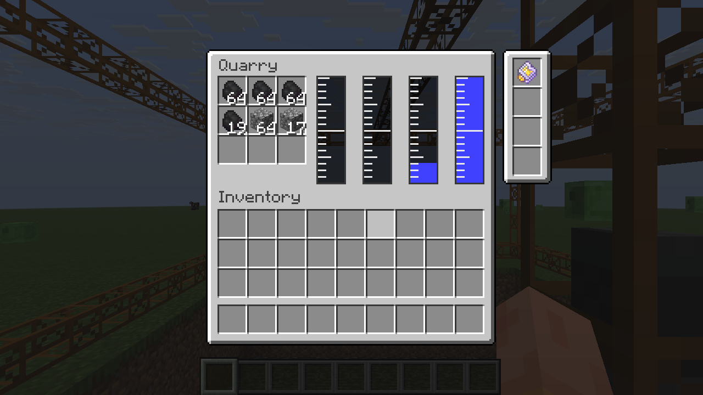

# BuildCraft Quarry Extras


Fabric add-on for [BuildCraft Refabricated](https://modrinth.com/mod/buildcraftrefabricated) (Minecraft 26.2). It changes nothing in the BuildCraft jar; everything is done with Mixins from a separate jar.



## What it adds to the quarry

- **Fluids are pumped away.** When the drill reaches a fluid source, the quarry flood-fills the connected sources of that fluid on that layer and pumps the whole pool at once; the task costs `pumpMjPerBucket` per source block, so big pools take longer. Pumping everything in one tick is what defeats vanilla "infinite water" (two neighbouring sources re-create the gap). Flowing fluid is ignored and drains by itself. Water flowing in from outside the frame is not stopped.
- **Multi-fluid tank.** In `COLLECT` mode every pumped source yields one bucket into the quarry's tank (default 4 slots x 16 buckets, one fluid per slot). Only as many sources as fit are pumped; when nothing fits the quarry waits and retries every second, like the BuildCraft pump. The tank pushes into adjacent fluid pipes and tanks every tick and can be pulled from by any Fabric Transfer API consumer (Refined Storage importer, external storage, ...). `VOID` mode deletes the fluid instead; `IGNORE` restores upstream behaviour.
- **Own inventory.** Mined items land in the quarry's 3 x 3 inventory first. Only the overflow goes to neighbours or the ground as before. Pipes and importers can extract from the quarry.
- **Upgrade slots.** Four slots in a Refined-Storage-style side panel accept RS's `fortune_1/2/3_upgrade` and `silk_touch_upgrade`. The highest fortune level (or silk touch, which wins) is applied to every block the quarry breaks.
- **GUI.** Right-click the quarry (any item except a BuildCraft wrench): the 3 x 3 inventory, one BuildCraft-style gauge per tank slot showing the fluid's real texture (hover for name and amount), upgrade slots in the side panel. Shift-click moves items, upgrades jump into the upgrade slots.
- **Blocks placed in the pit come first.** The already mined part of the pit is scanned top-down (a few thousand blocks per tick, so it is cheap even for big quarries). Anything minable found there, fluid sources included, is mined before the drill continues downwards, highest block first, also after the quarry has finished. Flowing fluid is ignored; it drains once its source is gone.

Breaking the quarry drops the inventory and the upgrades; fluid in the tank is lost.

## Config

`config/bcquarryfluids.json` (read on every server start):

| Key | Default | Meaning |
|---|---|---|
| `mode` | `COLLECT` | `IGNORE`, `VOID` or `COLLECT` |
| `tankCapacityMb` | `16000` | capacity of each tank slot |
| `fluidSlots` | `4` | different fluids the tank holds at once (1-8) |
| `pumpMjPerBucket` | `4` | energy per source block when pumping a pool (a stone block costs about 50 MJ to mine) |

## Requirements and installation

Minecraft 26.2, Fabric Loader 0.19.3+, Fabric API, BuildCraft Refabricated 26.7.27+mc26.2 (the jar the mixins were written against). Refined Storage is optional and only needed for the upgrades.

Download `bc-quarry-fluids-<version>.jar` from [Modrinth](https://modrinth.com/mod/bc-quarry-extras), CurseForge or the [GitHub releases](../../releases) and put it into `mods/` next to the unmodified BuildCraft Refabricated jar (server and client).

## Building

Drop `BCRefabricated-<version>+mc26.2.jar` into `libs/` (name in `gradle.properties`), then:

```powershell
./gradlew build
```

The jar lands in `build/libs/`. `./gradlew runServer` starts a dev server with BuildCraft (and Refined Storage, if its jar is in `libs/` too).

## How it hooks in

| Mixin | Target | Purpose |
|---|---|---|
| `TileQuarryMixin` | `buildcraft.builders.tile.TileQuarry` | tank, inventory, upgrades, persistence, fluid push, `canMine`/`canMoveThrough` for fluids |
| `TaskBreakBlockMixin` | `TileQuarry$TaskBreakBlock` | layer drain in `finish`, enchanted tool + inventory capture around `BlockUtil.breakBlockAndGetDropsWithXp` |
| `BCBuildersFabricMixin` | `BCBuildersFabric.registerNativeTransfer` | replaces the dummy quarry item storage with an extract-only view of the inventory |
| `BlockEntityMixin` | `BlockEntity.preRemoveSideEffects` | drops inventory and upgrades when the quarry is broken |

Upstream renames of these members will break the add-on; the reports in the log say which injector failed.

## License

MIT. BuildCraft Refabricated and BuildCraft are MPL-2.0 and are not redistributed here.
